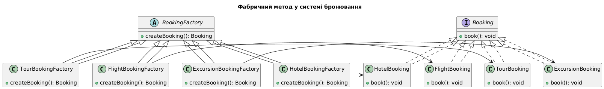
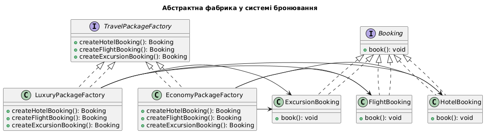
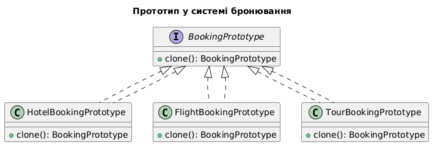
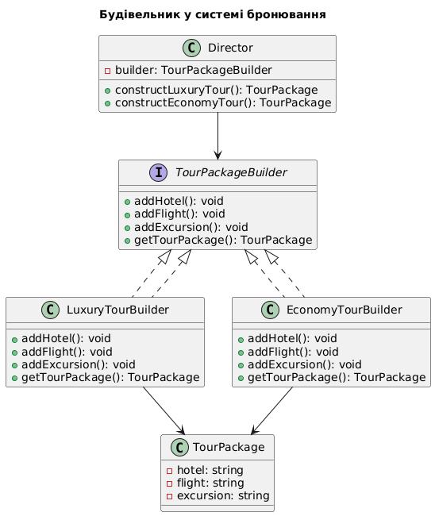
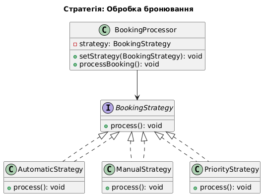
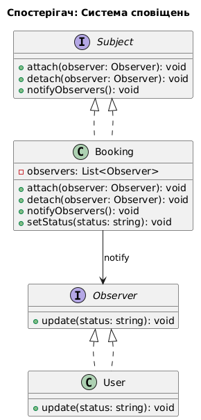
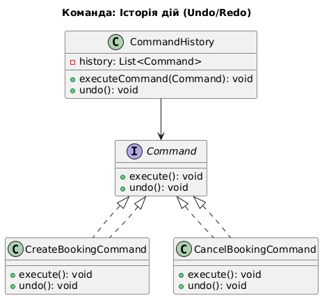
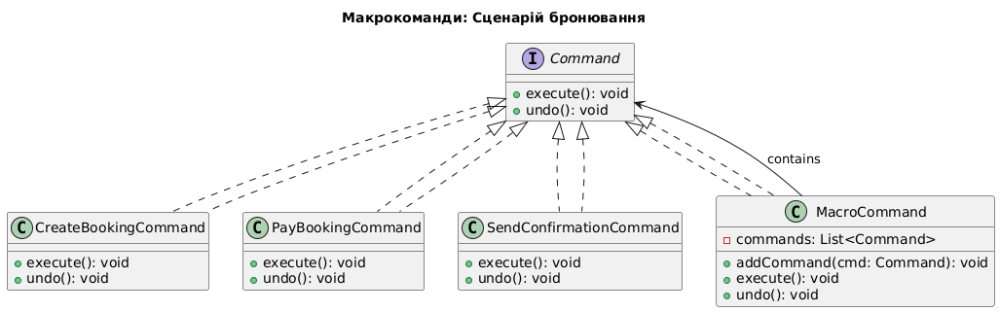
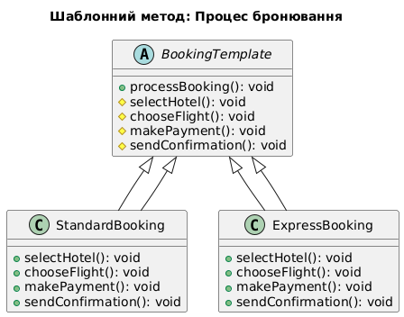

# object-oriented-programming-technologies
Object-oriented programming technologies academic subject

# 📝 Технічне завдання

## 📌 Проект: **Система Бронювання Готелів та Турів**

### 📖 Опис
Система бронювання дозволяє користувачам бронювати номери в готелях, авіаквитки, екскурсії та повні турпакети. 
В основі лежить гнучка система управління бронюваннями, яка підтримує різні категорії послуг та постачальників.

---

### 🛠 Технології
- 💻 **Мова**: PHP 8

---

# 📝 Технічне завдання лабораторна робота 1

---

### ✅ Функціональні вимоги
- 🔎 **Перегляд** доступних турів, готелів, авіаперельотів та екскурсій.
- 🏨 **Бронювання** окремих послуг або комплексного туру.
- 🤝 **Підтримка** різних постачальників послуг.
- ⚙️ **Адміністрування**: можливість додавання нових категорій без змін у коді.
- 🔄 **Стандартизований інтерфейс** для всіх типів бронювань.

---
### 🎭 Використання патернів
#### 🔹 **Фабричний метод (Factory Method)**
Фабричний метод використовується, коли потрібно делегувати створення об'єктів підкласам, які конкретизують тип 
створюваних об'єктів. У випадку системи бронювання він дозволяє створювати об'єкти бронювань без жорсткої прив'язки 
до їх конкретних класів. Це забезпечує гнучкість і масштабованість системи.

#### 🔹 **Проблема, яку вирішує фабричний метод**
- Використання new для створення об'єктів у коді робить систему негнучкою та складною для розширення.
- Змінюючи фабрику, можна легко додавати нові типи бронювань без зміни основного коду.

📌 **Компоненти:**
- **`Booking`** - базовий інтерфейс для всіх бронювань.
- **Конкретні класи:** `HotelBooking`, `FlightBooking`, `TourBooking`, `ExcursionBooking`.
- **Фабрика `BookingFactory`** з методом `createBooking()` для створення необхідного бронювання.

#### 🔹 **Абстрактна фабрика (Abstract Factory)**
Абстрактна фабрика дозволяє створювати групи взаємопов'язаних об'єктів без прив'язки до їх конкретних реалізацій. 
У системі бронювання вона використовується для створення комплексних турів, що включають кілька послуг 
(готелі, перельоти, екскурсії).

#### 🔹 **Проблема, яку вирішує фабричний метод**
- Замість створення об'єктів вручну та їх зв'язку між собою, фабрика дозволяє створювати їх як єдиний узгоджений набір.
- Полегшує додавання нових варіантів турів без зміни існуючого коду.

📌 **Компоненти:**
- **Інтерфейс `TravelPackageFactory`** для генерації турпакетів.
- **Класи `LuxuryPackageFactory`, `EconomyPackageFactory`** для різного рівня сервісу.
- **Методи:** `createHotelBooking()`, `createFlightBooking()`, `createExcursionBooking()`.

---

### 📊 Архітектурна схема
1️⃣ **Користувач** → Надсилає запит на бронювання.  
2️⃣ **Фабрика бронювань** (`BookingFactory`) → Визначає, який тип бронювання створити.  
3️⃣ **Створення бронювання** → `HotelBooking`, `FlightBooking`, `TourBooking` або `ExcursionBooking`.  
4️⃣ **Турпакет** (якщо потрібно) → Створюється через `LuxuryPackageFactory` або `EconomyPackageFactory`.  
5️⃣ **Підтвердження** → Збереження бронювання та надсилання користувачеві.  

---

### 🎯 Висновок до лабораторної роботи 1
Використання патернів Фабричний метод і Абстрактна фабрика дозволяє створювати модульну систему бронювання, яка легко 
розширюється та модифікується без внесення змін у вже працюючий код. Це відповідає принципам ООП, SOLID, а також спрощує 
тестування та підтримку коду.

Фабричний метод забезпечує гнучкість створення окремих бронювань.

Абстрактна фабрика дозволяє легко створювати турпакети без жорсткої прив'язки до конкретних класів.

Обидва підходи зменшують залежність між компонентами, що робить код чистішим та зрозумілішим.

Таким чином, система бронювання готелів та турів є легко масштабованою, підтримує розширення функціональності та забезпечує якісну архітектуру коду.

---

# 📝 Технічне завдання лабораторна 2

### ✅ Функціональні вимоги
- 🔎 **Клонування бронювань** для швидкого повторного створення.
- 🏨 **Створення складних турпакетів** з великою кількістю параметрів.
- 🔄 **Стандартизований інтерфейс** для роботи з бронюваннями.
- ⚙️ **Гнучке налаштування бронювань** без необхідності змінювати основний код.

---

### 🎭 Використання патернів
#### 🔹 **Прототип (Prototype)**
Прототипний патерн дозволяє клонувати об'єкти бронювання, що прискорює процес створення подібних бронювань.

### 🔹 Проблема, яку вирішує Прототип
- При створенні нового бронювання користувач часто вводить схожі дані.
- Прототип дозволяє уникнути повторного введення, зменшуючи кількість ручної роботи.

📌 **Компоненти:**
- **`BookingPrototype`** - базовий клас, що підтримує клонування.
- **Конкретні класи:** `HotelBookingPrototype`, `FlightBookingPrototype`, `TourBookingPrototype`.
- **Метод `clone()`**, що створює копію бронювання.

#### 🔹 **Будівельник (Builder)**
Будівельник використовується для створення складних турпакетів, дозволяючи налаштовувати параметри крок за кроком.

### 🔹 Проблема, яку вирішує Будівельник
- Турпакети можуть мати багато опціональних параметрів.
- Будівельник дозволяє створювати різні варіанти турів без жорсткої прив'язки до конкретного конструктора.

📌 **Компоненти:**
- **Інтерфейс `TourPackageBuilder`** для створення турпакетів.
- **Класи `LuxuryTourBuilder`, `EconomyTourBuilder`** для різного рівня сервісу.
- **Клас `Director`**, що управляє процесом створення пакетів.

---

### 📊 Архітектурна схема
1️⃣ **Користувач** → Обирає клонування або створення нового турпакету.  
2️⃣ **Прототип** (`clone()`) → Використовується для швидкого копіювання існуючих бронювань.  
3️⃣ **Будівельник** (`TourPackageBuilder`) → Використовується для поетапного налаштування туру.  
4️⃣ **Director** → Контролює процес створення повного туру.  
5️⃣ **Підтвердження** → Збереження бронювання та відправка користувачу.  

---

### 🎯 Висновок до лабораторної роботи 2
Використання патернів `Прототип` і `Будівельник` дозволяє:
- **Оптимізувати** процес бронювання за допомогою клонування.
- **Гнучко налаштовувати** складні бронювання без жорсткої прив'язки до класів.
- **Зменшити повторюваний код** і покращити підтримку проєкту.

Цей підхід відповідає принципам **ООП, SOLID**, покращує масштабованість та спрощує управління кодом. 🚀

---

# 📝 Технічне завдання лабораторна 3

## 📌 Проект: **Система Бронювання Готелів та Турів**

### 📖 Опис
Система бронювання дозволяє користувачам не тільки створювати замовлення, а й взаємодіяти з ними в режимі реального часу. Наприклад, користувачі можуть спостерігати за зміною статусу бронювання, вибирати метод обробки замовлення (автоматичний, ручний, пріоритетний), а також мати історію дій, які можуть бути скасовані або повторені.

---

### ✅ Функціональні вимоги
- ⚙️ **Можливість вибору стратегії обробки замовлень** (автоматична, ручна, пріоритетна).
- 👀 **Оповіщення користувача про зміну статусу бронювання.**
- ↩️ **Підтримка історії дій** (Undo/Redo).
- 🔄 **Гнучка інтеграція нових стратегій без зміни основного коду.**

---

### 🎭 Використання патернів
#### 🔹 **Стратегія (Strategy)**
Патерн дозволяє змінювати алгоритм обробки замовлень на льоту.

📌 **Компоненти:**
- **Інтерфейс `BookingStrategy`** з методом `process()`.
- **Класи `AutomaticStrategy`, `ManualStrategy`, `PriorityStrategy`** реалізують різні способи обробки.
- **Контекст `BookingProcessor`**, який приймає стратегію та виконує її.

### 🔹 Проблема, яку вирішує Strategy
- Забезпечує зміну поведінки без зміни коду класу `BookingProcessor`.
- Дозволяє легко додавати нові методи обробки замовлень.

#### 🔹 **Спостерігач (Observer)**
Користувачі підписуються на події та отримують повідомлення про зміни статусу бронювання.

📌 **Компоненти:**
- **Інтерфейс `Observer`**, що реалізує метод `update()`.
- **Клас `Booking` як Subject** з методами підписки/відписки та `notifyObservers()`.
- **Клас `User` як Observer** реалізує `update()` для отримання сповіщень.

### 🔹 Проблема, яку вирішує Observer
- Відділення логіки сповіщення від бізнес-логіки бронювання.
- Дозволяє мати кількох слухачів без прямої залежності від об’єкта.

#### 🔹 **Команда (Command)**
Патерн дозволяє інкапсулювати дії як об’єкти, щоб мати можливість скасування та повторення дій (Undo/Redo).

📌 **Компоненти:**
- **Інтерфейс `Command`** з методом `execute()` і `undo()`.
- **Класи `CreateBookingCommand`, `CancelBookingCommand`** реалізують конкретні дії.
- **Клас `CommandHistory`** зберігає список виконаних команд.

### 🔹 Проблема, яку вирішує Command
- Можливість реалізувати Undo/Redo для дій користувача.
- Відділення виклику дії від її реалізації.

---

### 📊 Архітектурна схема
1️⃣ **Користувач** → Взаємодіє з бронюванням (створює, змінює, скасовує).  
2️⃣ **Strategy** → Обробка бронювання згідно обраного алгоритму.  
 
3️⃣ **Observer** → Повідомлення підписаних користувачів про зміну статусу.  
 
4️⃣ **Command** → Збереження та виконання дій з можливістю скасування.  
 

---

### 🎯 Висновок
Патерни **Strategy**, **Observer** та **Command** забезпечують:
- **Динамічну зміну поведінки** залежно від обраної стратегії.
- **Реактивну взаємодію** з користувачем через механізм сповіщень.
- **Гнучке управління історією дій**, включаючи Undo/Redo.

Це дозволяє будувати масштабовану, інтерактивну систему бронювання, яка легко адаптується до нових вимог і є стійкою до змін. 🚀

---

# 📝 Технічне завдання лабораторна 4

## 📌 Проект: **Система Бронювання Готелів та Турів**

### 📖 Опис
Система бронювання підтримує виконання складних сценаріїв дій, таких як послідовна обробка кількох замовлень, застосування стандартних шаблонів дій, і гнучку конфігурацію черг виконання. Потрібно реалізувати можливість виконання макрокоманд (груп дій) та шаблонного методу (фіксована послідовність дій).

---

### ✅ Функціональні вимоги
- 🧩 **Виконання послідовностей команд** як єдиного сценарію.
- 🧭 **Використання фіксованих сценаріїв бронювання** (напр. стандартна процедура).
- 🔁 **Можливість комбінування декількох дій у "макрокоманду".**
- 📦 **Розширюваність без зміни основного коду.**

---

### 🎭 Використання патернів
#### 🔹 **Макрокоманди (Macro Command)**
Макрокоманда — це команда, яка складається з інших команд, що виконуються послідовно.

📌 **Компоненти:**
- **Інтерфейс `Command`** з методами `execute()` та `undo()`.
- **Конкретні команди:** `CreateBookingCommand`, `PayBookingCommand`, `SendConfirmationCommand`.
- **Клас `MacroCommand`**, що зберігає та виконує список команд.

🔹 **Проблема, яку вирішує Macro Command**
- Об'єднання кількох дій в один "сценарій" (наприклад, створити + оплатити + підтвердити).
- Зручне повторне використання і тестування таких сценаріїв.

---

#### 🔹 **Шаблонний метод (Template Method)**
Шаблонний метод визначає кістяк алгоритму, де конкретні кроки можуть перевизначатись у підкласах.

📌 **Компоненти:**
- **Абстрактний клас `BookingTemplate`** з методом `processBooking()`.
- **Класи-нащадки:** `StandardBooking`, `ExpressBooking`, які реалізують кроки.

🔹 **Проблема, яку вирішує Template Method**
- Стандартизація алгоритму бронювання.
- Спрощення додавання нових типів бронювань з мінімальними змінами.

---

### 📊 Архітектурна схема
1️⃣ **Користувач** → Запускає сценарій бронювання.  
2️⃣ **MacroCommand** → Послідовно виконує всі дії: створення, оплата, підтвердження.  
 
3️⃣ **Template Method** → Використовується для шаблонної логіки обробки.  
 

---

### 🎯 Висновок
Використання **MacroCommand** та **Template Method** дозволяє:
- **Будувати складні сценарії бронювання**, які легко масштабуються.
- **Реалізовувати стандартизовані алгоритми** з можливістю гнучкої адаптації.
- **Розширювати логіку**, не змінюючи вже існуючий код.

Такий підхід сприяє гнучкості, повторному використанню коду та легкості супроводу. 🚀

---

